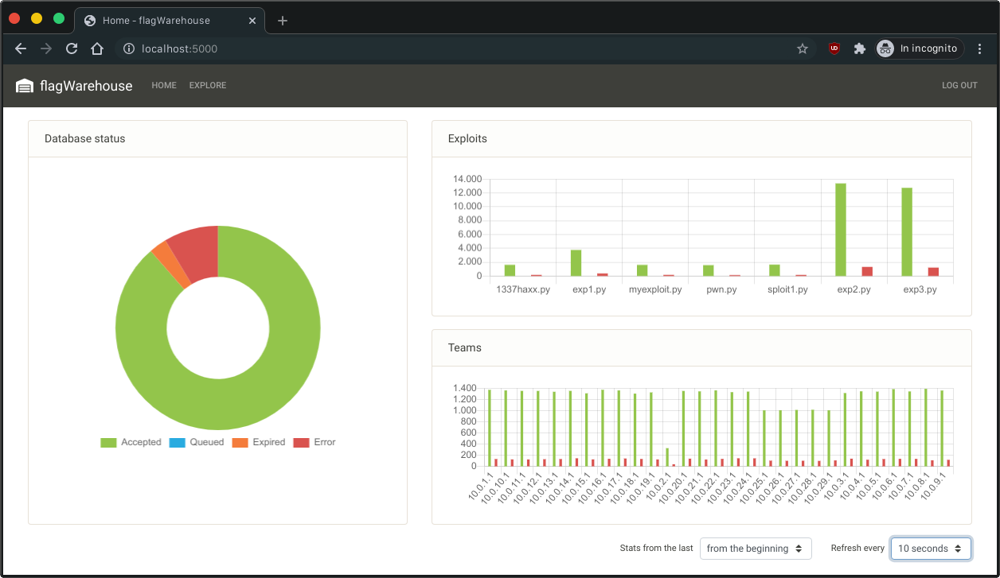

# flagWarehouse
Flag submission system for Attack/Defense CTFs.



* [Server](#server)
    * [Installation](#installation)
    * [Configuration](#configuration)
    * [Usage](#usage)
    * [Deployment (optional)](#deployment-optional)
* [Client](#client)

## Server
The server is a Flask web application that uses SQLite as its database engine. It stores flags and sends them
periodically to the verification server of the competition. It also provides an easy interface that shows some stats and
makes it possible to explore the database.

### Installation
```
git clone https://github.com/ecavicc/flagWarehouse.git
cd flagWarehouse/server
pip3 install -r requirements.txt
```
### Configuration
Edit the parameters in [config.py](server/config.py)

- `WEB_PASSWORD`: the password to access the web interface
- `FLAG_FORMAT`: string containing the regex format of the flags
- `YOUR_TEAM`: the ip address of your team
- `TEAMS`: the ip addresses of the teams in the competition
- `ROUND_DURATION`: the duration of a round (or *tick*) in seconds
- `FLAG_ALIVE`: the number of seconds a flag can be considered valid
- `SUB_LIMIT`: number of flags that can be sent to the organizers' server each `SUB_INTERVAL`
- `SUB_INTERVAL`: interval in seconds for the submission; if the submission round takes more than the number of seconds
                  specified, the background submission loop will not sleep
- `SUB_URL`: the url used for the verification of the flags
- `SUB_ACCEPTED`: the string used to verify whether the verification server accepted the flag

There is also the environment variable `FLASK_DEBUG` in [run.sh](server/run.sh): if set, any edit to the source files
(including the configuration file) while the server is running will trigger a restart with the new parameters.
Take note that **the submission loop will not be restarted automatically**, even in debug mode, so if you need to change
parameters that influence its behaviour, please restart the server manually.

### Usage
```
chmod +x run.sh
./run.sh
```
The web interface can be accessed on port 5000. To log in, use any username and the password you set.

If the password is wrong, the server logger will display a warning containing the username and the password used, as
well as the IP from which the request came from.

### Deployment (optional)
Given that most CTFs only last some hours and teams are usually not *that* big, the quickest and least painful approach
would be to self host the application and to use [ngrok](https://ngrok.com/).

If for any reason this approach doesn't suit you, you will need to make some modifications to the source code yourself;
for example, running this app *as is* on [Heroku](https://heroku.com) would probably be a bad idea since it uses SQLite
([here's why](https://devcenter.heroku.com/articles/sqlite3)), so you'll need to use `psycopg2` instead of `sqlite3` in
[db.py](server/application/db.py) (all the queries *should* be compatible, though).

For any other modifications, follow the guidelines for Flask deployment of your platform of choice.

## Client
The client is a simple Python program that runs all the programs (both scripts and binaries) in a specific directory.
The programs *need* to run only one time on one target (the target IP address is passed via argv by the client). For a
basic template, please refer to [example.py](client/exploits/example.py)

When it starts, the client automatically fetches the configuration from the server (targets, round duration etc.). When
the exploits print something on the standard output, the client reads the output in real time and extracts the flags
using the regex fetched from the server.